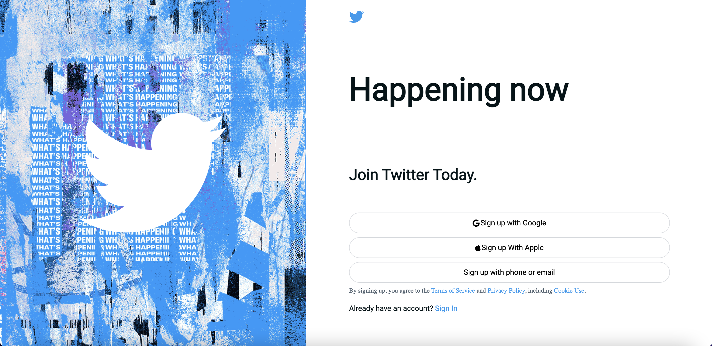
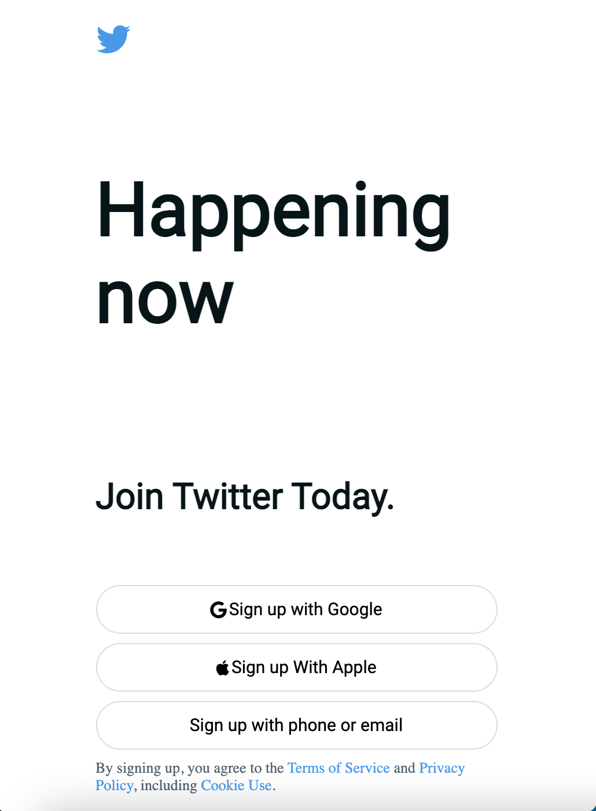

# Twitter Sign Up Page
> A recreation of the Twitter sign up page.

## Table of Contents
* [General Info](#general-information)
* [Technologies Used](#technologies-used)
* [Features](#features)
* [Screenshots](#screenshots)
* [Setup](#setup)
* [Usage](#usage)
* [Project Status](#project-status)
* [Acknowledgements](#acknowledgements)
* [Contact](#contact)
<!-- * [License](#license) -->

## General Information
- I created this project using HTML, CSS, Sass.
- I created this project to practice styling sign up forms.
<!-- You don't have to answer all the questions - just the ones relevant to your project. -->

## Technologies Used
- HTML
- CSS
- Sass

## Features
List the ready features here:
- Styling for the sign up page
- Responsive Design

## Screenshots

<!-- If you have screenshots you'd like to share, include them here. -->

## Setup
<!-- How to install the project.
1.  -->

## Usage
<!-- - `npm start`
- The application should open on your local host on your default web browser.
- To close the application enter `ctrl+c`. -->

## Project Status
Project is: _in progress_ 

## Acknowledgements
- This page was inpired by the [Twitter](https://www.twitter.com) landing page sign up form.
<!-- This project was based on [this tutorial](https://www.example.com). -->

## Contact
Created by [@javi](https://javiermelendrez.com/) - feel free to contact me!
